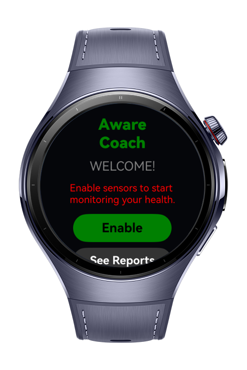
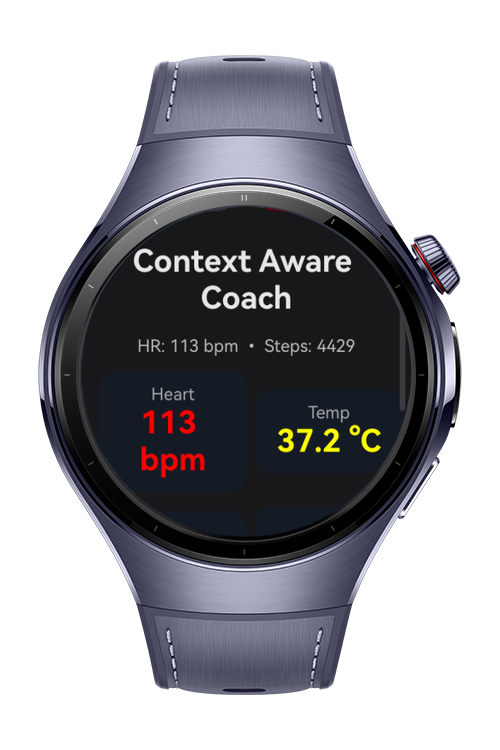

> **Note:** To access all shared projects, get information about environment setup, and view other guides, please visit [Explore-In-HMOS-Wearable Index](https://github.com/Explore-In-HMOS-Wearable/hmos-index).

# Context Aware Coach Demo

**Context Aware Demo** is a HarmonyOS wearable application that reads and interprets multi-sensor data in real time.
It demonstrates how a smartwatch can generate context awareness—detecting user activity, monitoring physiological signals, and updating the interface dynamically based on live sensor inputs.
# Preview
<div>
     
     
     
    
</div>

# Use Cases
- Read and Monitor Multiple Watch Sensors (Heart Rate, Temperature, Barometric Pressure, Accelerometer, Step Counter)
- Detect simple activity states (resting, walking, running)
- Display real-time sensor values on a unified screen
- Provide context-based feedback
- Trigger notifications based on sensor thresholds
 


# Technology

## Stack
- **Languages:** ArkTS (TypeScript)
- **UI:** ArkUI (`@kit.ArkUI`)
- **Tools/IDE:** DevEco Studio **6.0.0**
- **SDK:** HarmonyOS SDK **5.1.0.54**
- **Libraries:** SensorKit, NotificationKit, AbilityKit

# Directory Structure
```
entry/
└── src/
    └── main/
        └── ets/
            ├── pages/
            │   └── Index.ets
            └── common/
                └── PermissionHelper.ets

```

# Constraints and Restrictions

## Supported Device
- Huawei Watch 5

## App Limits
- On-device processing (no backend)
- Foreground workout tracking
- Optimized for wearables

# License
**Context Aware Coach** is distributed under the terms of the MIT License  
See the [LICENSE](./LICENSE) for more information.
